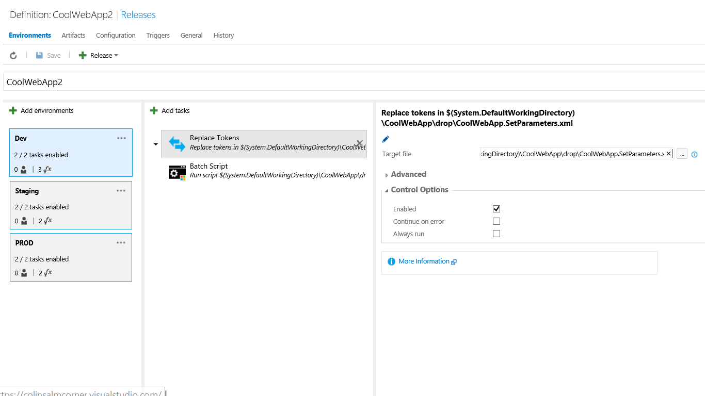

# Colin's ALM Corner Build Tasks - Replace Tokens



## Overview
This task invokes replaces tokens in a file with values from the matching varialbes set in the Environment.

## Settings
The task requires the following settings:

1. **Target File**: path to the file that contains the tokens.
2. **Token Regex**: a RegEx to find the tokens. Must include a group selector. This defaults to `__(\w+)__`. This
will match tokens that have double-underscore `__` prefix and postfix (e.g. `__MyVar__`).

## Environment Variables
The environment variables should use the name of the token without the token identifiers. They can be
defined in the Release (global - applies to all Environments) or in an Environment (in the variables
set for the Environment).

## Example:
Imagine you have a file with the following contents:
```
<?xml version="1.0" encoding="utf-8"?>
<parameters>
  <setParameter name="IIS Web Application Name" value="__SiteName__" />
</parameters>  
```

This file contains a token called "SiteName".

Drop the Task into the build or release, and then set the Target File to the path where the file is. Then set
a global variable or an environment variable called "SiteName" and give it the value you want the token to be
replaced with. That's it!

## Different Token Identifiers
If your tokens have a different identifier, then you can change the Token Regex. For example, if your tokens
are of the form `[[Token]]`, then you can change the Regex to `[[(\w+)]]` and the task will work.

## Gotchas
Be aware that there may be some existing environment variables on the build/release agent. For example
`Username` is set to the identity that the agent is running under. In order to avoid conflicts, you should
ensure that any tokens have a unique name. `WebUsername` is a better token than `Username` for this reason.