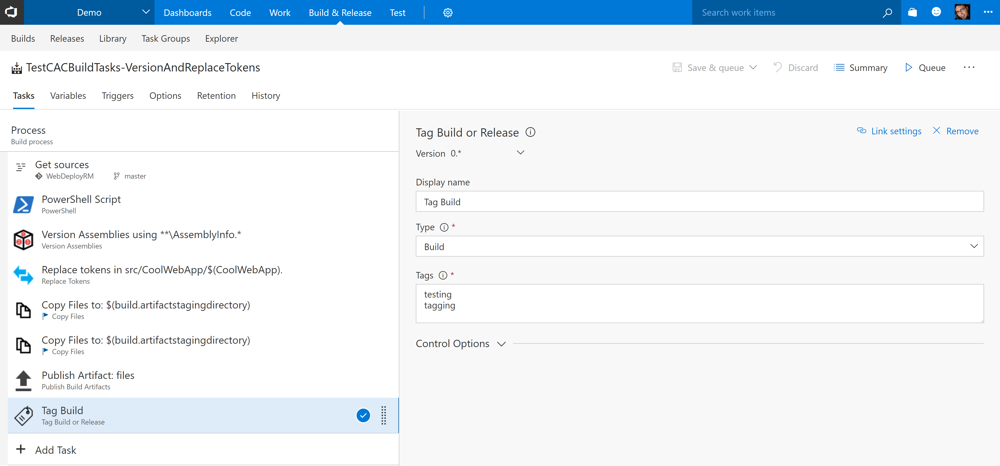

# Colin's ALM Corner Build Tasks - Tag Build



## Overview
This task tags the build with the tags specified.

## Settings
The task requires the following settings:

1. **Source path**: path to the folder that contains the files for tokenizing.
1. **File Pattern**: minimatch supported filter for file(s).
1. **Tokenize Type**: JSON is the only supported type currently.
1. **Includes**: Comma-separated list of properties to include. Use this to only tokenize a small number of values.
1. **Excludes**: Comma-separated list of properties to exclusd. Use this to excluse a small number of values.

## Includes and Excludes
If both Includes and Excludes is empty, then all values will be tokenized. If you wish to only tokenize a small subset of values,
then specify the full path for the values you want to tokenize. Similarly, use Excludes to exclude a small subset of values.

The "path" for the Includes and Excludes is the full JSON path in the file. For example, if the file is:

```JSON
{
  "ConnectionStrings": {
    "DefaultConnection": "Server=(localdb)\\mssqllocaldb;Database=aspnet-WebApplication1-26e8893e-d7c0-4fc6-8aab-29b59971d622;Trusted_Connection=True;MultipleActiveResultSets=true"
  },
  "Tricky": {
    "Gollum": "Smeagol",
    "Hobbit": "Frodo"
  },
  "Logging": {
    "IncludeScopes": false,
    "LogLevel": {
      "Default": "Debug",
      "System": "Information",
      "Microsoft": "Information"
    }
  }
}
```
and you wanted to just replace the DefaultConnection and the Tricky Gollum and Hobbit values, then Includes would need to be

```
ConnectionStrings.DefaultConnection,Tricky.Gollum,Tricky.Hobbit
```

After tokenization, the file would appear as follows:
```JSON
{
  "ConnectionStrings": {
    "DefaultConnection": "__ConnectionStrings.DefaultConnection__"
  },
  "Tricky": {
    "Gollum": "__Tricky.Gollum__",
    "Hobbit": "__Tricky.Hobbit__"
  },
  "Logging": {
    "IncludeScopes": false,
    "LogLevel": {
      "Default": "Debug",
      "System": "Information",
      "Microsoft": "Information"
    }
  }
}
```

## Using Tokenizer with ReplaceTokens
It is expected that this combination will be used for DotNet Core applications. You will likely want to tokenize the appsettings.json file during the build and then use the [ReplaceTokens](../ReplaceTokens) task to fill in
values during the Release. This is possible, but you will need to change the defaults for the ReplaceTokens task in order to work with
the json "namespaces". The following process will get you going:

1. Use the Tokenizer to tokenize the appsettings.json file as described above.
2. On the Release, enter the name of the tokens but substitute an `_` (underscore) for the `.` (period). Using the above example, you'd need three environment
variables: `ConnectionStrings_DefaultConnection`, `Tricky_Gollum` and `Tricky_Hobbit`.
3. On the Release, add a ReplaceTokens task and change the default Token Regex parameter to `__(\w+[\.\w+]*)__`